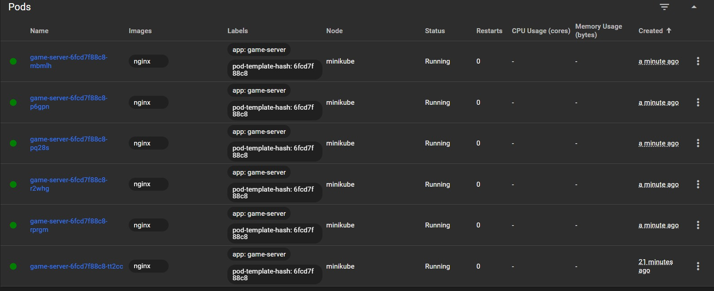
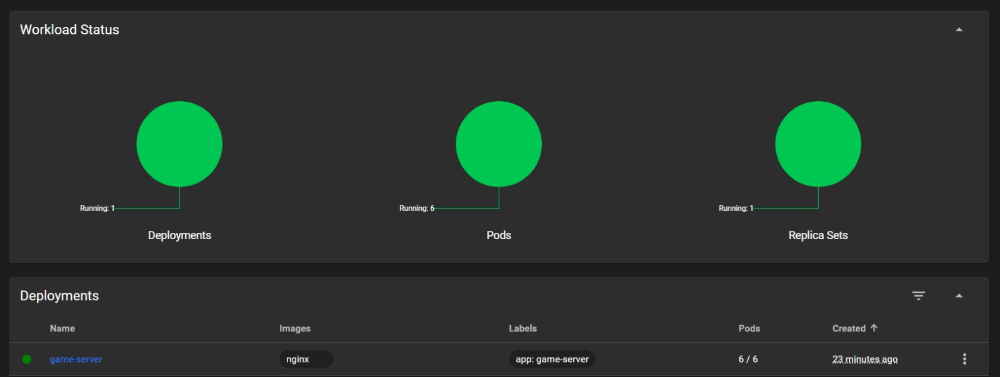

# behavioral-autoscaler

> Predicts Kubernetes scaling needs using **game player behavior signals** before CPU spikes happen — not after.

## The Idea

Standard K8s autoscalers only react *after* CPU crosses a threshold. By then, players are lagging.

This project watches player behavior (queue size, login rate, chat activity) and uses an LSTM to predict server load **10 minutes ahead**, then scales pods proactively.

## Quick Start

```bash
# 1. Install dependencies
pip install -r requirements.txt

# 2. Generate dataset
python simulator/traffic_sim.py

# 3. Train the model
python predictor/train.py

# 4. Run the pipeline
python pipeline/runner.py
```

No Kubernetes cluster needed — dry-run mode is on by default.

## Run Tests

```bash
python tests/test_collector.py
python tests/test_predictor.py
python tests/test_scaler.py
```

## Configuration

Edit `config.yaml` to change thresholds, replica counts, target deployment, and dry-run toggle.

## Research Context

Part of ongoing research into **Behavior-Driven Autoscaling** — using application-layer signals as cloud infrastructure triggers.

## Live Demo

### Autoscaler running in DRY RUN mode


### Live mode - pods scaling up on Kubernetes dashboard


### All 6 pods running after spike detected


### Autoscaler output during live spike
